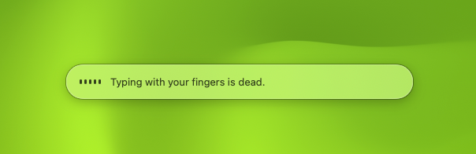
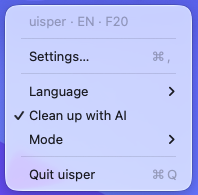
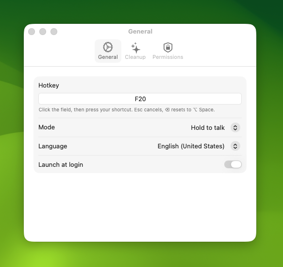

# uisper

Native, fully local dictation for macOS. Hold a key, speak, let go. Clean text lands in whatever app you are typing in.

Nothing leaves your Mac. No accounts, no cloud, no telemetry.



## How it works

1. Hold your hotkey. A small pill appears at the bottom of the screen.
2. Speak. Words show up in the pill as you talk.
3. Let go. A small on-device AI fixes grammar and punctuation, drops fillers like "uh" and "um", applies self-corrections ("send it Monday, no wait, Tuesday" becomes "send it Tuesday"), and spells your custom words the way you told it to.
4. The text is inserted at the cursor in the app that has focus.

Everything runs on Apple silicon inside macOS 26:

| Part | What it uses |
|---|---|
| Speech to text | Apple `SpeechAnalyzer`, on device, streaming |
| Cleanup | Apple Foundation Models, the on-device model behind Apple Intelligence |
| Text insertion | Accessibility API, with a paste fallback for Chrome and Electron apps |
| Hotkey | A global event tap, so hold-to-talk works everywhere |

## Screenshots

| Menu bar | Settings |
|---|---|
|  |  |

## Features

- Hold-to-talk or press-to-toggle.
- Any hotkey: click the field in Settings and press your shortcut. Modifier-only chords like Fn or Right Option work too.
- English, German, Brazilian Portuguese. Switch from the menu bar.
- AI cleanup on or off. Personal vocabulary list.
- Password fields are respected: when secure input is on, the text goes to the clipboard instead.
- Escape cancels. A tap shorter than 300 ms does nothing.

## Requirements

- macOS 26 or newer, Apple silicon.
- Apple Intelligence turned on for the cleanup step. Without it the raw transcript is inserted and the Cleanup tab says why. macOS requires the Mac language and the Siri language to match before it offers the Apple Intelligence switch.
- Xcode 26 and [xcodegen](https://github.com/yonaskolb/XcodeGen) to build.

## Build and run

```
brew install xcodegen
scripts/build.sh --open
```

The script generates the Xcode project, builds, signs with your local identity, and launches the app. It is a menu bar app; look for the microphone icon.

On first launch grant three permissions when asked: Microphone, Accessibility, Input Monitoring. The Permissions tab in Settings shows what is still missing. After granting Accessibility or Input Monitoring, quit and relaunch.

The app is not sandboxed and is not on the App Store. Global hotkeys and text insertion need permissions the App Store forbids.

## Tests

```
cd UisperCore && swift test
```

All logic lives in the `UisperCore` package and is tested there. The `Uisper` app target is a thin shell.

## Notes on hotkeys

- The default is Option+Space.
- On Apple keyboards F14 and F15 double as brightness keys at a level no app can intercept. Remap them with [Karabiner-Elements](https://karabiner-elements.pqrs.org) (for example F15 to F20) and record the mapped key.
- The hotkey is swallowed while held, so it does not type into the target app.

## Roadmap

- WhisperKit as a second engine, with automatic language detection.
- Per-app context: tone and vocabulary hints from the app and window you are typing in.

## License

MIT.
