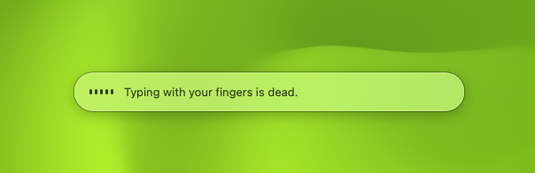
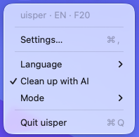
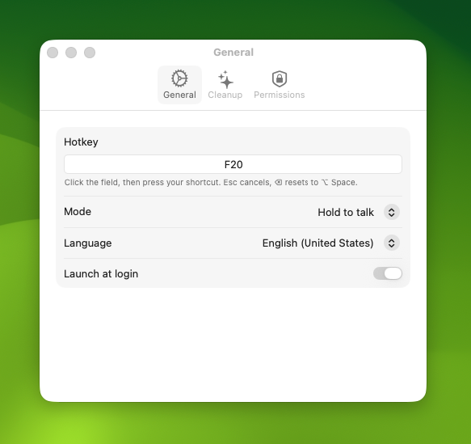

# uisper

Native, fully local dictation for macOS. Hold a key, speak, let go. Clean text lands in whatever app you are typing in.

Nothing leaves your Mac. No accounts, no cloud, no telemetry.

<p align="center"></p>

## Install

You need a Mac with Apple silicon running macOS 26 or newer. Nothing else.

1. Download the latest `uisper-x.y.z.zip` from [Releases](https://github.com/flykit-cc/uisper/releases).
2. Unzip it and move `uisper.app` to your Applications folder.
3. Right-click `uisper.app` and choose **Open**, then **Open** again in the dialog. This is needed once, because the build is not notarized by Apple.
4. Grant the three permissions macOS asks for: Microphone, Accessibility, Input Monitoring. Then quit uisper from the menu bar and open it again.
5. Leave it running for a few minutes the first time. uisper fetches two models it then keeps for good:
   - about **600 MB** for speech, into `~/Library/Application Support/FluidAudio/`
   - about **2.1 GB** for the cleanup, into `~/Library/Application Support/uisper/Models/`

   Settings › General shows the progress. Dictation works before they finish; you just get the raw words until the cleanup model is ready.

uisper lives in the menu bar. Look for the microphone icon.

Apple Intelligence is optional. uisper ships its own models and does not need it, but you can switch the cleanup to Apple's model in Settings if you prefer.

## Use

1. Hold your hotkey. A small pill appears at the bottom of the window you are in.
2. Speak. The pill shows the sound level, and with Apple's engine the words as you talk.
3. Let go. The text is transcribed, cleaned up and inserted at the cursor.

Press Escape while dictating to cancel. A tap shorter than 300 ms does nothing.

The default hotkey is Option+Space. Change it in Settings › General: click the field and press any shortcut. Modifier-only chords like Fn or Right Option work too.

<p align="center"></p>
<p align="center">Everything lives in the menu bar: language, cleanup toggle, hold or toggle mode.</p>

<p align="center"></p>
<p align="center">Click the hotkey field and press any shortcut. That is your key from then on.</p>

## What the cleanup does

A small AI model rewrites the raw transcript before it is inserted:

- Fixes punctuation, capitalization and grammar.
- Drops fillers like "uh" and "um" and false starts.
- Applies self-corrections: "send it Monday, no wait, Tuesday" becomes "send it Tuesday".
- Repairs words the speech engine misheard, when the context makes the right one obvious.
- Spells the words in your vocabulary list the way you told it to, even when they arrive split or misheard: "clot code" becomes "Claude Code".

It runs on your Mac. Turn it off in the menu bar when you want the raw words.

## The vocabulary learns

Add names and terms in Settings › Vocabulary, and uisper will spell them your way.

It also picks them up on its own. Correct a word by hand after dictating, and the next time you dictate in that app uisper notices the change and remembers your spelling. It only learns words that look like names, so ordinary edits like "call" to "called" are ignored.

Reading what you corrected needs the app to expose its text. Native apps do. Chrome and Electron apps do once uisper asks them to. Ghostty does through its own screen keybind. Other terminals cannot, so learning is off there — dictation itself still works everywhere.

## Features

- Hold-to-talk or press-to-toggle.
- Any hotkey, recorded by pressing it.
- English, German, Brazilian Portuguese. Switch from the menu bar.
- Two speech engines: the built-in one, or Apple's. Switch in Settings › General.
- Personal vocabulary list that grows from your own corrections.
- Password fields are respected: when secure input is on, the text goes to the clipboard instead.
- Works in every app, including Chrome and Electron apps, through a paste fallback.

## How it is built

Everything runs on device inside macOS 26:

| Part | What it uses |
|---|---|
| Speech to text | Parakeet TDT v3 on the Neural Engine, via [FluidAudio](https://github.com/FluidInference/FluidAudio). Apple `SpeechAnalyzer` is the alternative and streams words as you talk |
| Cleanup | Qwen3 4B on [MLX](https://github.com/ml-explore/mlx-swift-lm). Apple Foundation Models is the alternative |
| Text insertion | Accessibility API, with a paste fallback |
| Hotkey | A global event tap, so hold-to-talk works everywhere |

The app is not sandboxed and is not on the App Store. Global hotkeys and text insertion need permissions the App Store forbids.

## Build from source

Only needed if you want to change the code. Requires Xcode 26 and [xcodegen](https://github.com/yonaskolb/XcodeGen).

```
brew install xcodegen
scripts/build.sh --open
```

This generates the Xcode project, builds, signs with your local identity, and launches the app.

Tests:

```
cd UisperCore && swift test
```

All logic lives in the `UisperCore` package and is tested there. The `Uisper` app target is a thin shell.

To publish a release: `scripts/release.sh <version>`.

## Known limits

- On Apple keyboards, F14 and F15 double as brightness keys at a level no app can intercept. Remap them with [Karabiner-Elements](https://karabiner-elements.pqrs.org), for example F15 to F20, and record the mapped key.
- Cleanup speed depends on how busy your Mac is. On a calm machine it takes well under a second.
- The built-in speech engine transcribes once you let go, so words do not appear while you speak. Apple's engine shows them live. Pick whichever you prefer in Settings.
- A single dictation stops itself after ten minutes and inserts what you said.

## Roadmap

- Voice commands while dictating, like "new line" and "delete that".
- Transcript history.

## License

MIT.
